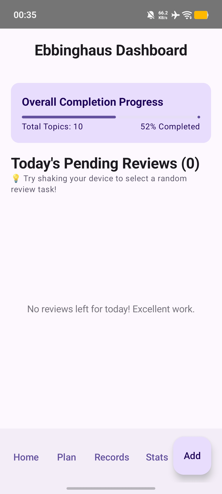
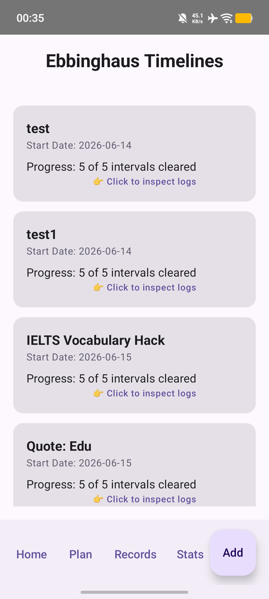
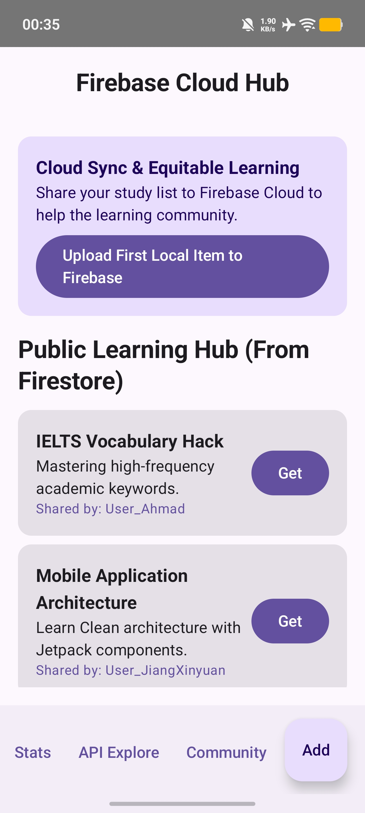

# SDG 4: Intelligent Ebbinghaus Memory Companion

An advanced, hardware-aware, and cloud-connected Android application built to combat the universal challenge of rapid knowledge decay. This project leverages the scientific **Ebbinghaus Spaced Repetition (Forgetting Curve)** methodology to structure optimized review schedules, directly contributing to **UN Sustainable Development Goal 4: Quality Education** by empowering lifelong learners with precision micro-learning tools.

---

## 📌 Project Overview & Metadata
- **Student Name:** JIANG XINYUAN
- **Student ID:** A207370
- **Course Code:** TK2323 / TM2213 (Mobile Programming / Mobile Application Programming)
- **Project Scope:** Project 2 (Advanced Data, APIs, & Sensor Integration)
- **Target SDG:** Goal 4: Quality Education (Target 4.4 - Increase the number of youth and adults who have relevant skills)

---

## 🎯 Problem Statement (SDG 4 Alignment)
In modern education, information overload paired with rapid cognitive retention drop-off poses a significant barrier to effective learning. According to the Ebbinghaus Forgetting Curve, humans lose roughly **70% of newly acquired knowledge within 24 hours** if no review occurs. 

This app directly addresses this educational gap by:
1. Translating static educational materials into dynamic, algorithmic review tracks.
2. Promoting structured lifelong learning paths independent of continuous classroom instruction.
3. Facilitating democratic peer-to-peer educational content distribution globally over the cloud.

---

## 🚀 Architectural Architecture: The Four Technical Pillars

As outlined by the project parameters, this updated system expands into a cohesive architecture utilizing four production-grade technical pillars:

### 1. Local Persistence (Room Database)
- **Implementation:** Thread-safe local storage using `Room`, `Dao`, and standard SQLite mappings driven by Kotlin Coroutines (`suspend functions`).
- **Reactive Stream:** Employs a continuous cold `Flow<List<StudyItem>>` that is collected safely as a reactive state inside the Jetpack Compose UI layout, enabling zero-refresh instant data synchronization.
- **Data Safety:** Implements custom Gson `@TypeConverters` to smoothly map complex arrays (Review Date Strings and Completion Status Booleans) into flat SQLite texts.

### 2. Cloud Integration (Firebase Firestore)
- **Multi-user Ecosystem:** Fully integrated with Firebase Cloud Firestore SDK allowing decentralized content curation.
- **Collaborative Sync:** Users can push local custom memory modules seamlessly onto the public live cloud repository (`Upload First Local Item to Firebase`) or pull shared crowd-sourced cards directly down into local Room arrays with one tap (`Get`).

### 3. Data From the Internet (Retrofit Web API)
- **Dynamic Content Integration:** Implements `Retrofit 2` for handling asynchronous HTTP requests over REST API protocols.
- **Contextual Adaptation:** Features an active content exploration screen where entering educational parameters asynchronously triggers endpoint fetching to stream down academic/motivational quotes (e.g., Nelson Mandela's insights on education) dynamically into the learner's workflow.

### 4. Hardware Awareness (Accelerometer Sensor)
- **Gamified Micro-Learning:** Hooks into the physical device's native `SensorManager` framework to actively process low-level raw `TYPE_ACCELEROMETER` data streams.
- **Algorithmic Detection:** Continually computes instant G-Force magnitudes ($G = \sqrt{x^2 + y^2 + z^2}$). When an explicit physical shaking gesture breaks defined thresholds, it instantly bypasses deep menus to flash a random urgent review task suggestion via a native Context Toast popup.

---

## 🗺️ UI Expansion (7 Distinct Screens Architecture)
The user interface has been modularly expanded from the baseline 5 screens into **7 standalone functional screens** wired together via a single `NavHostController`:

1. **Home Screen (`home`):** Main analytical dashboard tracking overarching completion progress rates alongside dynamic reactive lists.
2. **Add Screen (`add`):** Mathematical input layout calculating initial timestamps and multi-day interval retention schedules.
3. **Plan Screen (`plan`):** Chronological timeline detailing specific upcoming repetition targets mapped out on the curve.
4. **Records Screen (`records`):** Histograms / tracking sheets summarizing current logged memory events.
5. **Stats Screen (`stats`):** Deep analytical data review mapping global retention health parameters.
6. **API Explore Screen (`explore`):** Dynamic Retrofit controller pulling motivational quote arrays into native persistence states.
7. **Community Screen (`community`):** Distributed Firebase Firestore synchronization network allowing peer card streaming.

---

## 📸 Visual Evidence & Interface Demonstration
*(Note: These high-resolution screenshots represent live physical execution states of the core modules).*

### Figure 1: Reactive Home Dashboard & Hardware Awareness

*Detailed description of the interactive dashboard tracking real-time curve stats and displaying live local Room flow lists. This layout listens to the hardware Accelerometer to trigger shake-to-review notifications.*

### Figure 2: Asynchronous REST Web API Integration

*Demonstration of the external Retrofit network channel fetching educational insights and global quotes dynamically into offline persistence cache structures.*

### Figure 3: Peer-to-Peer Firebase Cloud Synchronization

*The distributed community workspace utilizing Firebase Firestore client streams to synchronize custom revision flashcards and multi-user data models globally.*

---

## 💻 Code Snippet Highlights

### Thread-Safe Architecture Setup (`EbbinghausViewModel.kt`)
```kotlin
// Cold Flow collection converting local Room queries into high-performance lifecycle-aware UI state
val studyList: StateFlow<List<StudyItem>> = studyDao.getAllItems()
    .stateIn(
        scope = viewModelScope,
        started = SharingStarted.WhileSubscribed(5000),
        initialValue = emptyList()
    )
